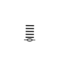
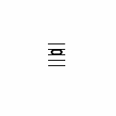

This repository contains a YOLOv5 model trained to recognize musical noteheads from sheet music images.
YOLOv5を使用し、音符の画像から音名を推測するモデルです。
現在のモデルは、1オクターブ異なる「ド」の全音符（C4とC5）を識別するよう学習済みです。

バウンディングボックスの範囲を「音符」のみとしたり、「音符」と「五線譜」を別々に認識させたりしてみましたが、
いずれもほとんど学習できていませんでした。
そこで、「音符」と「五線譜」を１つのまとまりとして学習させたところ、識別の精度を上げることができました。

今後のステップは、
音符単独での識別（完了）
　↓
1行の楽譜で複数の音符の識別（全音符のみ）
　↓
1行の楽譜で複数の音符の識別（4分音符や8分音符、シャープやフラットなどを含む）
　↓
1ページ分の楽譜（10～15行程度）で複数の音符の識別（アノテーションファイルの作成には前段階で学習したモデルを活用）
によって、一般的な楽譜からすべての音符を識別できるようになり、将来的には自動演奏機能なども付けたいと考えています。
